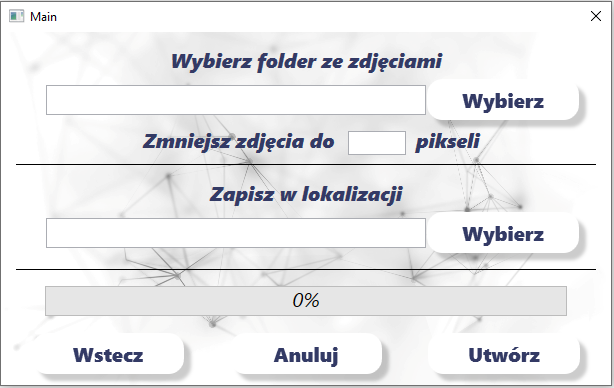
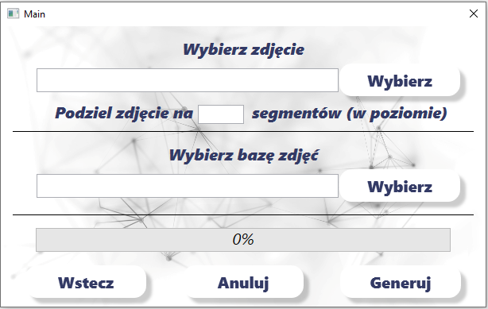
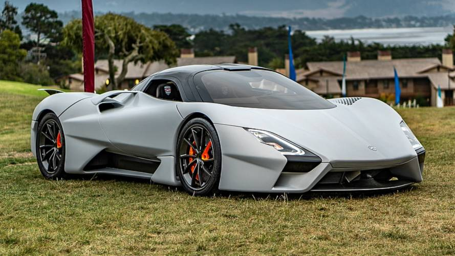
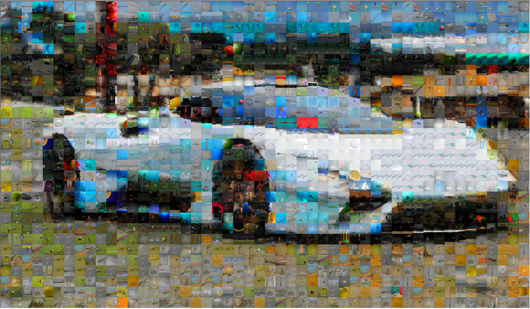
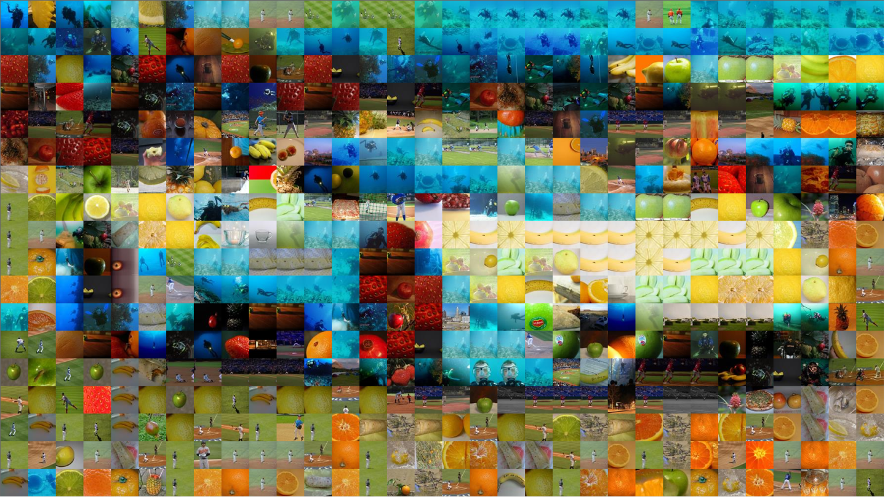

# Mozaic Generator

## Prerequisites

Project requires .NET Framework version 4.8. 

### Prepare images

The application has been divided into two parts. In order to generate photomozaic you need to prepare your images and some metadata.

**Caution!**
Creating a photomozaic requires beefy database of diverse images!
I tested the algorithm using >500k images but it might be an overkill.

Program will reshape images from given directory into squares and resize them into given dimensions ('normal' size photos are too big to create mozaic, preferable size is 100-200 pixels per height/width). 

It also serializes some information about images into `data.bin` file **(please do not remove/modify)**, which reduces computing time of each mozaic significantly.

### Create mozaic

Here you need to provide path to an image which mozaic should be made of, as well as path to database previously created.

The last input parameter is number of tiles (horizontally).

**Behaviour of the application is unknown if the database created in previous step was altered (don't do that).**

The mozaic is being saved in the input image's directory as `output.bmp`.

## Examples

Original

And mozaic with fairly big number of tiles.

Here's how it looks like with smaller number of tiles.

